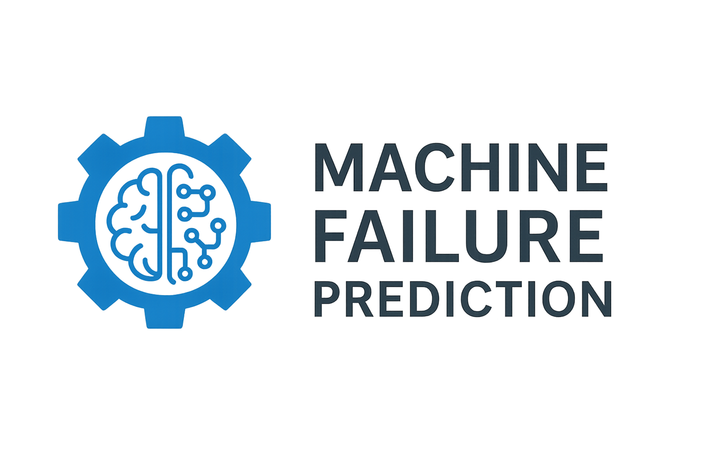

    

# Machine Failure Prediction

[Home](./index.md) | [Features](#features) | [Usage](#how-to-use) | [Outcome](#outcome) | [GitHub Repo](https://github.com/ervivek233/Machine-failure-prediction)

---

Machine Failure Prediction is a time-series ML project designed to reduce industrial downtime by predicting equipment failures before they happen. It uses historical sensor data to train supervised models that forecast imminent breakdowns and estimate remaining useful life.

🔍 Key Features

Data-Driven: Uses real-world sensor recordings for training and evaluation.

Model Variety: Includes Random Forest, XGBoost, RNN, and 1D-CNN architectures.

Robust Preprocessing: Handles missing values, normalization, and temporal slicing.

Evaluation Metrics: Precision, Recall, F1, ROC-AUC, and time-to-failure.  

Reproducible Setup: Requirements and training scripts included.

🚀 How It Works

Run train.py to preprocess data and train models.

Run app.py to serve predictions via a simple interface.

Inspect CSV data in the data/ folder using pandas or spreadsheet tools.

🎯 Outcome

The system generates actionable failure predictions with timestamps and confidence scores, enabling proactive maintenance scheduling.